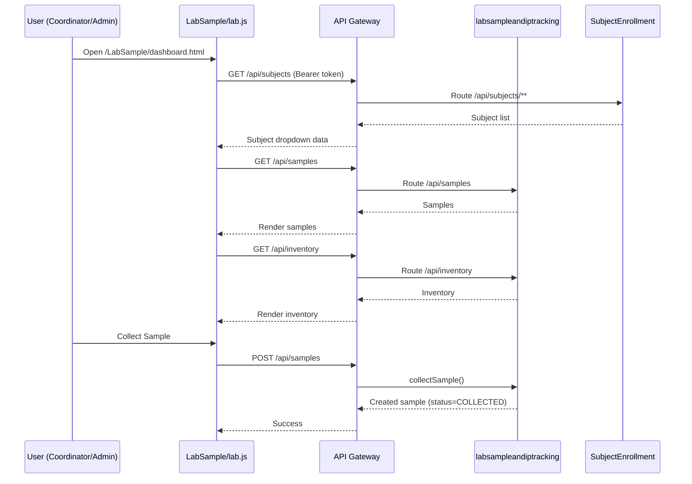

# Clinical Trial & Drug Development Tracking System
## Unified Architecture, Access Model, Ports, and End-to-End Flow

This README consolidates your **full system structure** in one place:
- service architecture and runtime topology
- role-based access and dashboard mapping
- home -> login -> JWT -> module request flow
- all known ports, service names, routes, and key config files
- operational caveats and troubleshooting pointers

---

## 1) Structural Diagram (System Topology)

```mermaid
flowchart LR
    Browser[Browser UI\nStatic pages from API Gateway] -->|/home/login.html| LoginJS[home.js]
    LoginJS -->|POST /auth/login| Gateway[API Gateway :8083]

    Gateway -->|/auth/**| Auth[auth-service :8085]
    Auth -->|JWT token + role + username| Browser

    Browser -->|Bearer token in Authorization| Gateway
    Gateway -->|JWT filter validates + injects headers\nX-User-Role, X-Username| Routes

    subgraph Routes[Gateway Routes]
      R1[/api/protocols/** -> trialprotocol-service/]
      R2[/api/subjects/** -> SubjectEnrollment/]
      R3[/api/visits/** -> visit-scheduling/]
      R4[/api/events/** -> adverseevent/]
      R5[/api/samples, /api/samples/**,\n/api/inventory, /api/inventory/** -> labsampleandiptracking/]
    end

    R1 --> TP[trialprotocol-service :8090]
    R2 --> SE[SubjectEnrollment :8089]
    R3 --> VS[visit-scheduling :8086]
    R4 --> AE[adverseevent :8087]
    R5 --> LS[LabSampleAndIPTracking (ctds) :8088]

    TP --> DB[(MySQL)]
    SE --> DB
    VS --> DB
    AE --> DB
    LS --> DB
    Auth --> DB

    Gateway <-->|service discovery| Eureka[Eureka Server :8761]
    Auth <-->|register/discover| Eureka
    TP <-->|register/discover| Eureka
    SE <-->|register/discover| Eureka
    VS <-->|register/discover| Eureka
    AE <-->|register/discover| Eureka
    LS <-->|register/discover| Eureka

    Gateway <-->|config import| Config[Config Server :8888]
    Auth <-->|config import| Config
    TP <-->|config import| Config
    SE <-->|config import| Config
    VS <-->|config import| Config
    AE <-->|config import| Config
    LS <-->|config import| Config
```

---

## 2) Home -> Login -> JWT -> Lab Sample Flow (Detailed)

### Step A: Home and Login UI
1. User opens `api-gateway/src/main/resources/static/home/index.html`.
2. User clicks **Sign In** -> `home/login.html`.
3. `home/home.js` `doLogin()` sends:
   - `POST /auth/login`
   - JSON body: `{ username, password }`

### Step B: Authentication
4. API Gateway routes `/auth/**` -> `auth-service`.
5. `AuthService` validates credentials (BCrypt compare).
6. `JwtUtil` generates JWT with:
   - subject = username
   - claim `role` = user role
   - configured expiration
7. Response returns `{ token, role, username }`.

### Step C: Frontend Session + Redirect
8. `home/app.js` stores auth info in localStorage:
   - `token`, `role`, `username`
9. Redirect happens via `DASHBOARDS` map:
   - `COORDINATOR -> /LabSample/dashboard.html`

### Step D: Protected API Access
10. `LabSample/lab.js` calls APIs using `api()` helper (`app.js`), which adds:
   - `Authorization: Bearer <token>`
11. API Gateway `JwtAuthenticationFilter`:
   - validates token
   - extracts role + username
   - forwards `X-User-Role`, `X-Username`
12. Gateway routes:
   - `/api/samples*` and `/api/inventory*` -> `labsampleandiptracking`
   - `/api/subjects/**` -> `SubjectEnrollment`
13. Lab UI shows subjects, samples, inventory and allows sample collection/dispense flows.

---

## 3) Role Access Matrix (Who has which access)

### Dashboard mapping (login destination)
- `ADMIN` -> `/TrialProtocol/admin.html`
- `INVESTIGATOR` -> `/subjectenrollment/dashboard.html`
- `DATA_MANAGER` -> `/VisitSchedule/dashboard.html`
- `PHARMACOVIGILANCE_OFFICER` -> `/AdverseEvent/dashboard.html`
- `COORDINATOR` -> `/LabSample/dashboard.html`

### Module guard in frontend (`requireRole` calls)
| Module | Guard in JS | Effective Access |
|---|---|---|
| Trial Protocol | `requireRole("ADMIN")` | ADMIN (+ADMIN bypass behavior already inherent) |
| Subject Enrollment | `requireRole("INVESTIGATOR", "COORDINATOR")` | INVESTIGATOR, COORDINATOR, ADMIN |
| Visit Scheduling | `requireRole("DATA_MANAGER")` | DATA_MANAGER, ADMIN |
| Adverse Event | `requireRole("PHARMACOVIGILANCE_OFFICER")` | PHARMACOVIGILANCE_OFFICER, ADMIN |
| Lab Sample & IP | `requireRole("COORDINATOR")` | COORDINATOR, ADMIN |

### Important behavior
- In `home/app.js`, `ADMIN` is explicitly allowed to pass role checks across modules.

---

## 4) Service Registry: Names, Ports, Purpose

| Service | `spring.application.name` | Port | Purpose |
|---|---|---:|---|
| API Gateway | `api-gateway` | 8083 | Single entrypoint for static UI + API routing + JWT filter |
| Auth Service | `auth-service` | 8085 | Login, JWT issuance, user management |
| Trial Protocol | `trialprotocol-service` | 8090 | Protocol + site lifecycle |
| Subject Enrollment | `SubjectEnrollment` | 8089 | Screening, enrollment, consent, withdrawal |
| Visit Scheduling | `visit-scheduling` | 8086 | Visit + CRF workflow |
| Adverse Event | `adverseevent` | 8087 | AE reporting and safety flow |
| Lab Sample & IP Tracking (`ctds`) | `labsampleandiptracking` | 8088 | Sample lifecycle + inventory/dispense |
| Eureka Server | `eureka-server` | 8761 | Service discovery |
| Config Server | `config-server` | 8888 | Centralized configuration source |

---

## 5) API Gateway Route Map

| Route Pattern | Target URI |
|---|---|
| `/auth/**`, `/users/**` | `lb://auth-service` |
| `/api/protocols/**` | `lb://trialprotocol-service` |
| `/api/subjects/**` | `lb://SubjectEnrollment` |
| `/api/visits/**` | `lb://visit-scheduling` |
| `/api/events/**` | `lb://adverseevent` |
| `/api/samples`, `/api/samples/**`, `/api/inventory`, `/api/inventory/**` | `lb://labsampleandiptracking` |

> Note: explicit exact paths for `/api/samples` and `/api/inventory` are included to avoid 404 on non-trailing-slash endpoint usage.

---

## 6) Security Design (Spring Security + JWT)

### auth-service security chain
- Stateless session policy.
- `permitAll` for `/auth/**` and `/users/**` (as currently coded).
- Passwords validated via `PasswordEncoder` (BCrypt).

### gateway JWT enforcement
- Public prefix: `/auth/`
- Protected prefixes: `/api/`, `/users`
- For protected paths:
  - requires Bearer token
  - validates signature and claims
  - forwards user role and username via headers

### frontend token usage
- Shared `api()` helper attaches `Authorization: Bearer <token>` for module API calls.
- `logout()` clears local storage and redirects to `/home/index.html`.

---

## 7) Lab Sample & IP Tracking Internal Workflow



### Sample lifecycle enforced by service
- `COLLECTED -> IN_TRANSIT -> ANALYZED -> DESTROYED`

### Inventory/dispense behavior
- validates positive IDs/quantity
- checks stock availability
- updates dispensed/available
- returns dispense log metadata

---

## 8) Config Files: What each file contains

### Core infra
- `config-server/src/main/resources/application.properties`
  - Config server app name, port `8888`, native profile, config location.
- `eureka-server/src/main/resources/application.properties`
  - Eureka app name, port `8761`, self-registration/fetch disabled.

### API gateway
- `api-gateway/src/main/resources/application.properties`
  - gateway name/port, config import, eureka url, jwt secret, fallback route definitions.
- `config-server/src/main/resources/config/api-gateway.properties`
  - centralized gateway routes and runtime properties.
- `api-gateway/src/main/java/com/genc/api_gateway/config/GatewayConfig.java`
  - Java DSL route definitions.
- `api-gateway/src/main/java/com/genc/api_gateway/filter/JwtAuthenticationFilter.java`
  - JWT validation and role/username header forwarding.

### Auth
- `auth-service/auth-service/src/main/resources/application.properties`
  - app name/port, config import, datasource, JWT secret/expiration, eureka settings.
- `config-server/src/main/resources/config/auth-service.properties`
  - centralized auth properties.

### Domain services
- `trialprotocol/src/main/resources/application.properties`
- `SubjectEnrollment/src/main/resources/application.properties`
- `visit-scheduling/src/main/resources/application.properties`
- `adverseevent/src/main/resources/application.properties`
- `ctds/src/main/resources/application.properties`

Each includes a combination of:
- app name
- service port
- config-server import
- eureka registration/fetch settings
- datasource + JPA + Hikari fallback values

---

## 9) Startup Order (Recommended)

1. `eureka-server` (8761)
2. `config-server` (8888)
3. `auth-service`
4. domain services (`trialprotocol`, `SubjectEnrollment`, `visit-scheduling`, `adverseevent`, `ctds`)
5. `api-gateway` (8083)

Then open UI from gateway static path (e.g., `/home/index.html`).

---

## 10) Known Operational Notes

- Admin has global frontend access through role-check bypass in `requireRole()`.
- JWT secret must remain aligned between auth-service token generation and gateway token validation.
- Route definitions exist in multiple layers (config server + local fallback + Java DSL); keep them consistent.
- If a UI page changes under `src/main/resources/static`, running app may require sync/rebuild/restart depending on launch mode.

---

## 11) Quick Reference: Key Paths

### Frontend
- `api-gateway/src/main/resources/static/home/index.html`
- `api-gateway/src/main/resources/static/home/login.html`
- `api-gateway/src/main/resources/static/home/home.js`
- `api-gateway/src/main/resources/static/home/app.js`
- `api-gateway/src/main/resources/static/LabSample/dashboard.html`
- `api-gateway/src/main/resources/static/LabSample/lab.js`

### Backend and routing
- `api-gateway/src/main/java/com/genc/api_gateway/config/GatewayConfig.java`
- `api-gateway/src/main/java/com/genc/api_gateway/filter/JwtAuthenticationFilter.java`
- `auth-service/auth-service/src/main/java/com/example/auth_service/config/SecurityConfig.java`
- `auth-service/auth-service/src/main/java/com/example/auth_service/controller/AuthController.java`
- `auth-service/auth-service/src/main/java/com/example/auth_service/service/AuthService.java`
- `ctds/src/main/java/com/genc/ctds/samplelog/controller/LabSampleApiController.java`
- `ctds/src/main/java/com/genc/ctds/samplelog/service/SampleService.java`

---

## 12) Access Summary (One-Line)

- **ADMIN**: full access to all dashboards
- **INVESTIGATOR**: Subject Enrollment
- **DATA_MANAGER**: Visit Scheduling
- **PHARMACOVIGILANCE_OFFICER**: Adverse Event
- **COORDINATOR**: Lab Sample & IP Tracking (and Subject Enrollment page allows coordinator in current JS)

